# Affinity Echo - Complete Backend Technical Documentation

## Table of Contents
1. [Purpose and Scope](#1-purpose-and-scope)
2. [Requirements Analysis](#2-requirements-analysis)
3. [Database Design](#3-database-design)
4. [Technology Stack & Libraries](#4-technology-stack--libraries)
5. [Technical Standards](#5-technical-standards)
6. [Project Structure](#6-project-structure)
7. [Detailed Module Breakdown](#7-detailed-module-breakdown)
8. [Testing Requirements](#8-testing-requirements)
9. [6-Week Delivery Plan](#9-6-week-delivery-plan)
10. [Deployment Architecture](#10-deployment-architecture)
11. [Development Prioritization](#11-development-prioritization)
12. [Risk Mitigation](#12-risk-mitigation)

## 1. Purpose and Scope

### 1.1 Project Overview
Affinity Echo is an anonymous-first professional networking platform for underrepresented communities in tech, featuring forums, mentorship, job referrals, and secure messaging with progressive identity revelation.

### 1.2 Core Objectives
- Provide safe, anonymous professional networking
- Enable progressive identity revelation
- Facilitate job referrals and mentorship
- Ensure enterprise-grade security and privacy
- Scale to 100,000+ users

### 1.3 Scope Boundaries
**In Scope:**
- User management and authentication
- Forum discussions with anonymity
- Referral marketplace with identity revelation
- Mentorship matching and management
- Real-time messaging
- Notifications system
- Search and discovery

**Out of Scope:**
- Video conferencing (v1)
- Payment processing (v1)
- Mobile apps (v2)
- Advanced analytics (v2)

## 2. Requirements Analysis

### 2.1 Functional Requirements

#### User Management
- FR1: User registration with email/password
- FR2: Anonymous profile creation
- FR3: Multi-step onboarding flow
- FR4: Privacy level management
- FR5: Profile verification system

#### Forum System
- FR6: Anonymous topic creation
- FR7: Nested comment threads
- FR8: Reaction system (seen, validated, inspired, heard)
- FR9: Content moderation tools
- FR10: Affinity-based forum access

#### Referral System
- FR11: Referral post creation (requests/offers)
- FR12: Connection request management
- FR14: Slot management for referral offers
- FR15: Referral success tracking

#### Mentorship
- FR16: Mentor/mentee matching algorithm
- FR17: Session scheduling
- FR18: Progress tracking
- FR19: Feedback and rating system
- FR20: Availability management
- FR21: Progressive identity revelation

#### Messaging
- FR21: Real-time encrypted messaging
- FR22: File sharing with size limits
- FR23: Typing indicators
- FR24: Conversation history
- FR25: Block and report features

### 2.2 Non-Functional Requirements

#### Performance
- NFR1: API response time < 200ms for 95% of requests
- NFR2: Support 10,000 concurrent users
- NFR3: Real-time messaging latency < 100ms
- NFR4: Search queries response < 500ms

#### Security
- NFR5: End-to-end encryption for sensitive data
- NFR6: SOC 2 compliance framework
- NFR7: Regular security audits and penetration testing
- NFR8: GDPR and CCPA compliance

#### Scalability
- NFR9: Horizontal scaling capability
- NFR10: Database read replica support
- NFR11: Caching layer for frequent queries
- NFR12: CDN integration for static assets

#### Reliability
- NFR13: 99.9% uptime SLA
- NFR14: Automated backup and recovery
- NFR15: Comprehensive monitoring and alerting
- NFR16: Disaster recovery plan

## 3. Database Design

### 3.1 Complete Table Schema

#### Core Authentication Tables (Supabase Managed)
```sql
-- auth.users (Managed by Supabase)
-- id, email, created_at, updated_at, etc.
```

#### Application Tables

**user_profiles**
```sql
CREATE TABLE user_profiles (
  id UUID PRIMARY KEY REFERENCES auth.users(id) ON DELETE CASCADE,
  username TEXT NOT NULL UNIQUE CHECK (length(username) >= 3 AND length(username) <= 50),
  avatar TEXT DEFAULT '👤',
  bio TEXT,
  company TEXT,
  job_title TEXT,
  location TEXT,
  years_experience INTEGER CHECK (years_experience >= 0),
  skills TEXT[] DEFAULT '{}',
  linkedin_url TEXT,
  
  -- Onboarding & Demographics
  has_completed_onboarding BOOLEAN DEFAULT false,
  is_willing_to_mentor BOOLEAN DEFAULT false,
  badges TEXT[] DEFAULT '{}',
  career_level TEXT CHECK (career_level IN ('entry', 'mid', 'senior', 'lead', 'executive')),
  affinity_tags TEXT[] DEFAULT '{}',
  
  -- Encrypted Demographics (application-level encryption)
  race_encrypted TEXT,
  gender_encrypted TEXT,

  
  -- Privacy & Settings
  privacy_level TEXT DEFAULT 'anonymous' CHECK (privacy_level IN ('anonymous', 'pseudonymous', 'public')),
  email_notifications BOOLEAN DEFAULT true,
  push_notifications BOOLEAN DEFAULT true,
  
  -- Statistics
  reputation_score INTEGER DEFAULT 0,
  total_posts INTEGER DEFAULT 0,
  total_comments INTEGER DEFAULT 0,
  helpful_votes_received INTEGER DEFAULT 0,
  mentorship_sessions_completed INTEGER DEFAULT 0,
  successful_referrals INTEGER DEFAULT 0,
  
  -- Timestamps
  created_at TIMESTAMPTZ DEFAULT NOW(),
  updated_at TIMESTAMPTZ DEFAULT NOW(),
  last_active_at TIMESTAMPTZ DEFAULT NOW(),
  
  -- Indexes
  INDEX idx_user_profiles_username (username),
  INDEX idx_user_profiles_company (company),
  INDEX idx_user_profiles_created_at (created_at DESC)
);
```

**referral_posts**
```sql
CREATE TABLE referral_posts (
  id UUID PRIMARY KEY DEFAULT gen_random_uuid(),
  user_id UUID NOT NULL REFERENCES auth.users(id) ON DELETE CASCADE,
  
  -- Post Content (application-level encrypted)
  type TEXT NOT NULL CHECK (type IN ('request', 'offer')),
  title_encrypted TEXT NOT NULL,
  company_encrypted TEXT NOT NULL,
  job_title_encrypted TEXT,
  job_link TEXT,
  description_encrypted TEXT NOT NULL,
  
  -- Metadata
  scope TEXT NOT NULL DEFAULT 'global' CHECK (scope IN ('global', 'company', 'affinity')),
  status TEXT NOT NULL DEFAULT 'open' CHECK (status IN ('open', 'closed', 'filled', 'expired')),
  affinity_groups TEXT[] DEFAULT '{}',
  
  -- Slot Management
  available_slots INTEGER CHECK (available_slots >= 0),
  total_slots INTEGER CHECK (total_slots >= 0),
  
  -- Engagement Metrics
  views_count INTEGER DEFAULT 0 CHECK (views_count >= 0),
  likes_count INTEGER DEFAULT 0 CHECK (likes_count >= 0),
  comments_count INTEGER DEFAULT 0 CHECK (comments_count >= 0),
  bookmarks_count INTEGER DEFAULT 0 CHECK (bookmarks_count >= 0),
  connection_requests_count INTEGER DEFAULT 0 CHECK (connection_requests_count >= 0),
  
  -- Tags & Categorization
  tags TEXT[] DEFAULT '{}',
  required_skills TEXT[] DEFAULT '{}',
  preferred_experience TEXT CHECK (preferred_experience IN ('entry', 'mid', 'senior', 'any')),
  
  -- Timestamps
  created_at TIMESTAMPTZ DEFAULT NOW(),
  updated_at TIMESTAMPTZ DEFAULT NOW(),
  last_activity_at TIMESTAMPTZ DEFAULT NOW(),
  expires_at TIMESTAMPTZ,
  
  -- Indexes
  INDEX idx_referral_posts_user_id (user_id),
  INDEX idx_referral_posts_type_status (type, status),
  INDEX idx_referral_posts_created_at (created_at DESC),
  INDEX idx_referral_posts_tags (tags),
  INDEX idx_referral_posts_scope (scope)
);
```

**referral_connections**
```sql
CREATE TABLE referral_connections (
  id UUID PRIMARY KEY DEFAULT gen_random_uuid(),
  referral_post_id UUID NOT NULL REFERENCES referral_posts(id) ON DELETE CASCADE,
  sender_id UUID NOT NULL REFERENCES auth.users(id) ON DELETE CASCADE,
  receiver_id UUID NOT NULL REFERENCES auth.users(id) ON DELETE CASCADE,
  
  -- Status & Communication
  status TEXT NOT NULL DEFAULT 'pending' CHECK (status IN ('pending', 'accepted', 'rejected', 'cancelled')),
  message_encrypted TEXT,
  sender_notes_encrypted TEXT,
  receiver_notes_encrypted TEXT,
  
  
  -- Outcome Tracking
  referral_submitted BOOLEAN DEFAULT false,
  interview_scheduled BOOLEAN DEFAULT false,
  offer_received BOOLEAN DEFAULT false,
  outcome_notes TEXT,
  
  -- Timestamps
  created_at TIMESTAMPTZ DEFAULT NOW(),
  updated_at TIMESTAMPTZ DEFAULT NOW(),
  responded_at TIMESTAMPTZ,
  
  -- Constraints & Indexes
  UNIQUE(referral_post_id, sender_id, receiver_id),
  CHECK (sender_id != receiver_id),
  INDEX idx_referral_connections_sender (sender_id),
  INDEX idx_referral_connections_receiver (receiver_id),
  INDEX idx_referral_connections_status (status)
);
```

**identity_reveals**
```sql
CREATE TABLE identity_reveals (
  id UUID PRIMARY KEY DEFAULT gen_random_uuid(),
  connection_id UUID NOT NULL REFERENCES referral_connections(id) ON DELETE CASCADE,
  requester_id UUID NOT NULL REFERENCES auth.users(id) ON DELETE CASCADE,
  responder_id UUID NOT NULL REFERENCES auth.users(id) ON DELETE CASCADE,
  
  status TEXT NOT NULL DEFAULT 'pending' CHECK (status IN ('pending', 'accepted', 'declined', 'expired')),
  requester_message_encrypted TEXT,
  
  created_at TIMESTAMPTZ DEFAULT NOW(),
  updated_at TIMESTAMPTZ DEFAULT NOW(),
  responded_at TIMESTAMPTZ,
  
  -- Constraints & Indexes
  UNIQUE(connection_id, requester_id, responder_id),
  CHECK (requester_id != responder_id),
  INDEX idx_identity_reveals_connection (connection_id),
  INDEX idx_identity_reveals_requester (requester_id),
  INDEX idx_identity_reveals_responder (responder_id)
);
```

**forum_topics**
```sql
CREATE TABLE forum_topics (
  id UUID PRIMARY KEY DEFAULT gen_random_uuid(),
  user_id UUID NOT NULL REFERENCES auth.users(id) ON DELETE CASCADE,
  forum_id TEXT NOT NULL,
  
  -- Content
  title TEXT NOT NULL CHECK (length(title) >= 5 AND length(title) <= 200),
  content TEXT NOT NULL CHECK (length(content) >= 10 AND length(content) <= 10000),
  content_encrypted TEXT,
  
  -- Metadata
  scope TEXT NOT NULL DEFAULT 'global' CHECK (scope IN ('global', 'company', 'affinity')),
  is_anonymous BOOLEAN DEFAULT true,
  is_pinned BOOLEAN DEFAULT false,
  is_locked BOOLEAN DEFAULT false,
  tags TEXT[] DEFAULT '{}',
  affinity_groups TEXT[] DEFAULT '{}',
  
  -- Engagement Metrics
  views_count INTEGER DEFAULT 0 CHECK (views_count >= 0),
  comments_count INTEGER DEFAULT 0 CHECK (comments_count >= 0),
  reaction_seen_count INTEGER DEFAULT 0,
  reaction_validated_count INTEGER DEFAULT 0,
  reaction_inspired_count INTEGER DEFAULT 0,
  reaction_heard_count INTEGER DEFAULT 0,
  
  -- Timestamps
  created_at TIMESTAMPTZ DEFAULT NOW(),
  updated_at TIMESTAMPTZ DEFAULT NOW(),
  last_activity_at TIMESTAMPTZ DEFAULT NOW(),
  
  -- Indexes
  INDEX idx_forum_topics_user_id (user_id),
  INDEX idx_forum_topics_forum_id (forum_id),
  INDEX idx_forum_topics_created_at (created_at DESC),
  INDEX idx_forum_topics_scope (scope)
);
```

**forum_comments**
```sql
CREATE TABLE forum_comments (
  id UUID PRIMARY KEY DEFAULT gen_random_uuid(),
  topic_id UUID NOT NULL REFERENCES forum_topics(id) ON DELETE CASCADE,
  user_id UUID NOT NULL REFERENCES auth.users(id) ON DELETE CASCADE,
  parent_comment_id UUID REFERENCES forum_comments(id) ON DELETE CASCADE,
  
  content TEXT NOT NULL CHECK (length(content) >= 1 AND length(content) <= 2000),
  content_encrypted TEXT,
  is_anonymous BOOLEAN DEFAULT true,
  
  -- Moderation
  is_removed BOOLEAN DEFAULT false,
  removed_reason TEXT,
  
  -- Engagement
  helpful_count INTEGER DEFAULT 0,
  supportive_count INTEGER DEFAULT 0,
  
  created_at TIMESTAMPTZ DEFAULT NOW(),
  updated_at TIMESTAMPTZ DEFAULT NOW(),
  
  -- Indexes
  INDEX idx_forum_comments_topic_id (topic_id),
  INDEX idx_forum_comments_user_id (user_id),
  INDEX idx_forum_comments_parent_id (parent_comment_id),
  INDEX idx_forum_comments_created_at (created_at DESC)
);
```

**topic_reactions**
```sql
CREATE TABLE topic_reactions (
  id UUID PRIMARY KEY DEFAULT gen_random_uuid(),
  topic_id UUID NOT NULL REFERENCES forum_topics(id) ON DELETE CASCADE,
  user_id UUID NOT NULL REFERENCES auth.users(id) ON DELETE CASCADE,
  
  reaction_type TEXT NOT NULL CHECK (reaction_type IN ('seen', 'validated', 'inspired', 'heard')),
  
  created_at TIMESTAMPTZ DEFAULT NOW(),
  
  -- Constraints & Indexes
  UNIQUE(topic_id, user_id, reaction_type),
  INDEX idx_topic_reactions_topic_id (topic_id),
  INDEX idx_topic_reactions_user_id (user_id)
);
```

**mentorship_relationships**
```sql
CREATE TABLE mentorship_relationships (
  id UUID PRIMARY KEY DEFAULT gen_random_uuid(),
  mentor_id UUID NOT NULL REFERENCES auth.users(id) ON DELETE CASCADE,
  mentee_id UUID NOT NULL REFERENCES auth.users(id) ON DELETE CASCADE,
  
  -- Relationship Details
  status TEXT NOT NULL DEFAULT 'pending' CHECK (status IN ('pending', 'active', 'paused', 'completed', 'cancelled')),
  mentor_skills TEXT[] DEFAULT '{}',
  mentee_goals_encrypted TEXT,
  meeting_frequency TEXT CHECK (meeting_frequency IN ('weekly', 'biweekly', 'monthly', 'as_needed')),
  
  -- Session Tracking
  total_sessions INTEGER DEFAULT 0,
  completed_sessions INTEGER DEFAULT 0,
  next_session_at TIMESTAMPTZ,
  
  -- Feedback
  mentor_rating INTEGER CHECK (mentor_rating >= 1 AND mentor_rating <= 5),
  mentee_rating INTEGER CHECK (mentee_rating >= 1 AND mentee_rating <= 5),
  mentor_feedback TEXT,
  mentee_feedback TEXT,
  
  -- Timestamps
  created_at TIMESTAMPTZ DEFAULT NOW(),
  updated_at TIMESTAMPTZ DEFAULT NOW(),
  started_at TIMESTAMPTZ,
  completed_at TIMESTAMPTZ,
  
  -- Constraints & Indexes
  CHECK (mentor_id != mentee_id),
  INDEX idx_mentorship_relationships_mentor (mentor_id),
  INDEX idx_mentorship_relationships_mentee (mentee_id),
  INDEX idx_mentorship_relationships_status (status)
);
```

**mentorship_sessions**
```sql
CREATE TABLE mentorship_sessions (
  id UUID PRIMARY KEY DEFAULT gen_random_uuid(),
  relationship_id UUID NOT NULL REFERENCES mentorship_relationships(id) ON DELETE CASCADE,
  
  -- Session Details
  scheduled_at TIMESTAMPTZ NOT NULL,
  duration_minutes INTEGER NOT NULL CHECK (duration_minutes >= 15 AND duration_minutes <= 240),
  meeting_url TEXT,
  agenda_encrypted TEXT,
  
  -- Status & Notes
  status TEXT NOT NULL DEFAULT 'scheduled' CHECK (status IN ('scheduled', 'completed', 'cancelled', 'no_show')),
  mentor_notes_encrypted TEXT,
  mentee_notes_encrypted TEXT,
  session_notes_encrypted TEXT,
  
  -- Feedback
  mentor_feedback TEXT,
  mentee_feedback TEXT,
  mentor_rating INTEGER CHECK (mentor_rating >= 1 AND mentor_rating <= 5),
  mentee_rating INTEGER CHECK (mentee_rating >= 1 AND mentee_rating <= 5),
  
  created_at TIMESTAMPTZ DEFAULT NOW(),
  updated_at TIMESTAMPTZ DEFAULT NOW(),
  
  -- Indexes
  INDEX idx_mentorship_sessions_relationship (relationship_id),
  INDEX idx_mentorship_sessions_scheduled (scheduled_at)
);
```

**notifications**
```sql
CREATE TABLE notifications (
  id UUID PRIMARY KEY DEFAULT gen_random_uuid(),
  user_id UUID NOT NULL REFERENCES auth.users(id) ON DELETE CASCADE,
  actor_id UUID REFERENCES auth.users(id) ON DELETE SET NULL,
  
  -- Notification Content
  type TEXT NOT NULL CHECK (type IN (
    'follow', 'forum_post', 'forum_comment', 'forum_like', 
    'nook_post', 'referral_post', 'referral_comment', 
    'referral_connection', 'mentorship_request', 'mentorship_accepted',
    'mentorship_message', 'identity_reveal', 'system'
  )),
  title TEXT NOT NULL,
  message TEXT NOT NULL,
  action_url TEXT,
  
  -- Reference Tracking
  reference_id UUID,
  reference_type TEXT,
  metadata JSONB DEFAULT '{}',
  
  -- Delivery Status
  is_read BOOLEAN DEFAULT false,
  is_delivered BOOLEAN DEFAULT false,
  action_taken BOOLEAN DEFAULT false,
  delivery_method TEXT[] DEFAULT '{"in_app"}',
  
  -- Timestamps
  created_at TIMESTAMPTZ DEFAULT NOW(),
  read_at TIMESTAMPTZ,
  delivered_at TIMESTAMPTZ,
  
  -- Indexes
  INDEX idx_notifications_user_id (user_id),
  INDEX idx_notifications_created_at (created_at DESC),
  INDEX idx_notifications_is_read (is_read),
  INDEX idx_notifications_type (type)
);
```

**user_follows**
```sql
CREATE TABLE user_follows (
  id UUID PRIMARY KEY DEFAULT gen_random_uuid(),
  follower_id UUID NOT NULL REFERENCES auth.users(id) ON DELETE CASCADE,
  following_id UUID NOT NULL REFERENCES auth.users(id) ON DELETE CASCADE,
  
  created_at TIMESTAMPTZ DEFAULT NOW(),
  
  -- Constraints & Indexes
  UNIQUE(follower_id, following_id),
  CHECK (follower_id != following_id),
  INDEX idx_user_follows_follower (follower_id),
  INDEX idx_user_follows_following (following_id)
);
```

**conversations**
```sql
CREATE TABLE conversations (
  id UUID PRIMARY KEY DEFAULT gen_random_uuid(),
  
  -- Participants
  user1_id UUID NOT NULL REFERENCES auth.users(id) ON DELETE CASCADE,
  user2_id UUID NOT NULL REFERENCES auth.users(id) ON DELETE CASCADE,
  
  -- Context
  context_type TEXT CHECK (context_type IN ('referral', 'mentorship', 'direct')),
  context_id UUID,
  
  -- Status
  is_active BOOLEAN DEFAULT true,
  user1_cleared_at TIMESTAMPTZ,
  user2_cleared_at TIMESTAMPTZ,
  
  -- Identity
  user1_identity_revealed BOOLEAN DEFAULT false,
  user2_identity_revealed BOOLEAN DEFAULT false,
  
  created_at TIMESTAMPTZ DEFAULT NOW(),
  updated_at TIMESTAMPTZ DEFAULT NOW(),
  last_message_at TIMESTAMPTZ DEFAULT NOW(),
  
  -- Constraints & Indexes
  CHECK (user1_id != user2_id),
  UNIQUE(user1_id, user2_id, context_type, context_id),
  INDEX idx_conversations_user1 (user1_id),
  INDEX idx_conversations_user2 (user2_id),
  INDEX idx_conversations_updated (updated_at DESC)
);
```

**messages**
```sql
CREATE TABLE messages (
  id UUID PRIMARY KEY DEFAULT gen_random_uuid(),
  conversation_id UUID NOT NULL REFERENCES conversations(id) ON DELETE CASCADE,
  sender_id UUID NOT NULL REFERENCES auth.users(id) ON DELETE CASCADE,
  
  -- Message Content (encrypted)
  content_encrypted TEXT NOT NULL,
  content_type TEXT NOT NULL DEFAULT 'text' CHECK (content_type IN ('text', 'file', 'system')),
  
  -- File attachments
  file_url TEXT,
  file_name TEXT,
  file_size INTEGER,
  file_type TEXT,
  
  -- Delivery Status
  is_delivered BOOLEAN DEFAULT false,
  is_read BOOLEAN DEFAULT false,
  read_at TIMESTAMPTZ,
  
  -- Moderation
  is_flagged BOOLEAN DEFAULT false,
  flagged_reason TEXT,
  
  created_at TIMESTAMPTZ DEFAULT NOW(),
  
  -- Indexes
  INDEX idx_messages_conversation (conversation_id),
  INDEX idx_messages_sender (sender_id),
  INDEX idx_messages_created (created_at DESC)
);
```

### 3.2 Database Relationships

auth.users (1) ←→ (1) user_profiles  
auth.users (1) ←→ (N) referral_posts  
auth.users (1) ←→ (N) referral_connections (as sender)  
auth.users (1) ←→ (N) referral_connections (as receiver)  
referral_posts (1) ←→ (N) referral_connections  
referral_connections (1) ←→ (N) identity_reveals  
auth.users (1) ←→ (N) forum_topics  
forum_topics (1) ←→ (N) forum_comments  
forum_topics (1) ←→ (N) topic_reactions  
auth.users (1) ←→ (N) mentorship_relationships (as mentor)  
auth.users (1) ←→ (N) mentorship_relationships (as mentee)  
mentorship_relationships (1) ←→ (N) mentorship_sessions  
auth.users (1) ←→ (N) notifications  
auth.users (1) ←→ (N) user_follows (as follower)  
auth.users (1) ←→ (N) user_follows (as following)  
auth.users (1) ←→ (N) conversations (as user1)  
auth.users (1) ←→ (N) conversations (as user2)  
conversations (1) ←→ (N) messages  

## 4. Technology Stack & Libraries

### 4.1 Core Backend Stack

**Runtime & Framework:**
```json
{
  "nodejs": "18.x LTS",
  "typescript": "5.x",
  "nestjs": "10.x",
  "express": "4.x"
}
```

**Database & ORM:**
```json
{
  "supabase": "2.x",
  "postgresql": "15.x",
  "typeorm": "0.3.x",
  "redis": "4.x"
}
```

### 4.2 Essential Libraries

#### Security & Authentication
```json
{
  "@nestjs/jwt": "JWT token management",
  "@nestjs/passport": "Authentication strategies",
  "bcryptjs": "Password hashing",
  "helmet": "Security headers",
  "express-rate-limit": "Rate limiting",
  "crypto-js": "Encryption utilities",
  "validator": "Input validation",
  "sanitize-html": "XSS prevention"
}
```

#### API & Validation
```json
{
  "class-validator": "DTO validation",
  "class-transformer": "Object transformation",
  "joi": "Schema validation",
  "compression": "Response compression",
  "cors": "Cross-origin resource sharing"
}
```

#### Real-time & Messaging
```json
{
  "socket.io": "WebSocket communication",
  "bull": "Redis-based job queue",
  "node-cron": "Task scheduling",
  "ws": "WebSocket server"
}
```

#### File Handling & Storage
```json
{
  "multer": "File upload handling",
  "@aws-sdk/client-s3": "AWS S3 integration",
  "sharp": "Image processing",
  "mime-types": "File type detection"
}
```

#### Monitoring & Logging
```json
{
  "winston": "Structured logging",
  "prom-client": "Metrics collection",
  "newrelic": "APM monitoring",
  "pino": "High-performance logging"
}
```

#### Testing
```json
{
  "jest": "Testing framework",
  "@nestjs/testing": "NestJS testing utilities",
  "supertest": "HTTP assertion testing",
  "testcontainers": "Integration testing with Docker"
}
```

#### Development & Build
```json
{
  "eslint": "Code linting",
  "prettier": "Code formatting",
  "husky": "Git hooks",
  "lint-staged": "Pre-commit checks",
  "nodemon": "Development file watching"
}
```

### 4.3 Library Justification

**NestJS:** Provides modular architecture, dependency injection, and strong TypeScript support essential for microservices.

**TypeORM:** Type-safe database operations with excellent TypeScript integration and migration support.

**Redis:** High-performance caching, session storage, and message queue for real-time features.

**Socket.io:** Reliable real-time communication with fallback options and room management.

**Bull:** Redis-based job queue for background processing with retry mechanisms and progress tracking.

## 5. Technical Standards

### 5.1 Code Standards

#### TypeScript Configuration
```json
{
  "strict": true,
  "noImplicitAny": true,
  "strictNullChecks": true,
  "strictFunctionTypes": true,
  "noImplicitReturns": true,
  "noUnusedLocals": true,
  "noUnusedParameters": true
}
```

#### API Response Standards
```typescript
interface ApiResponse<T> {
  success: boolean;
  data: T;
  message?: string;
  meta?: {
    page?: number;
    limit?: number;
    total?: number;
    hasNext?: boolean;
  };
}

interface ApiError {
  success: false;
  error: {
    code: string;
    message: string;
    details?: any;
  };
}
```

### 5.2 Security Standards

#### Encryption Standards
- AES-256-GCM for field-level encryption
- RSA-2048 for key exchange
- PBKDF2 for key derivation
- Regular key rotation (90 days)

#### Authentication Standards
- JWT tokens with 7-day expiry
- Refresh token rotation
- Session invalidation on password change
- Multi-factor authentication ready

## 6. Project Structure

### 6.1 Additional Features, Security Clarifications & Moderation

#### 6.1.1 Avatar generator (User management)
Purpose: Deterministic, privacy-preserving default avatars for anonymous profiles; defer image uploads until robust moderation exists.

Implementation:
- Deterministic emoji + palette generator: server-side seed derived from user_id → avatar_descriptor (emoji + palette). Store only avatar_seed / descriptor (no image bytes).
- Client: preview component renders emoji + palette before save.
- Image uploads: disabled by default. Enable later only after image moderation + human review, rate limits, and file scanning.
- Storage (future): S3 with signed URLs + virus scanning; store only references (not public URLs).

DB / API:
- Add avatar_seed TEXT to user_profiles. Example migration:
```sql
ALTER TABLE user_profiles ADD COLUMN avatar_seed TEXT;
```
Security:
- No PII embedded in generated avatars. Uploaded images must be quarantined and approved before public exposure.

#### 6.1.2 Identity revelation — ownership & behaviour
Summary:
- Progressive, multi-stage identity-reveal workflow is owned by Mentorship (mentorship_service, mentorship_relationships, mentorship_sessions, identity_reveals).
- Referral-service keeps a lightweight single-stage reveal flow (request/accept/decline) and may link to mentorship progressive-reveal when user opts in.

Service responsibilities:
- Mentorship-service: staged consent, audit trail, timed expiries, revocation, decays.
- Referral-service: simple request/consent records and clear FK/ownership; do not conflate logs with mentorship audit trails.

Data model note:
- Maintain distinct identity_reveal records per domain with explicit ownership and FK constraints; audit metadata should include key_version, actor_id, timestamp, and reason.

#### 6.1.3 Moderation & ML editorial pipeline (privacy-first)
Requirements:
- Deploy affinity-echo-moderation-v1 (fine-tuned distilbert) for real-time text classification; self-host where low-latency required, fallback to hosted inference.
- Privacy-first: moderation pipelines must NOT receive raw PII. Logs contain only user_id and fingerprint_hash.
- Thresholds & targets:
  - score < 0.3 → Auto-Approve
  - 0.3 ≤ score < 0.7 → Hold for human review
  - score ≥ 0.7 → Auto-Hide + Notify user
  - false positive target < 2%; latency < 300ms (GPU inference)
- Post-moderation: report handling, human-in-loop escalation, confidence-based auto-remove rules per security doc.
- Image moderation: required before enabling avatar uploads or public file attachments.

Pre-Moderation flow:

```mermaid
flowchart TD
  A[User submits post / comment / message] --> B[AI pre-moderation]
  B --> |score < 0.3| C[Auto-approve]
  B --> |0.3 ≤ score < 0.7| D[Hold for human review]
  B --> |score ≥ 0.7| E[Auto-hide + notify user]
  D --> F[Human moderator queue]
  F --> |approve| C
  F --> |remove| E
```


Enforcement workflow:
```mermaid
flowchart LR
  I[Infraction detected] --> S{Strikes count}
  S --> |0| A0[Warn + Educate]
  S --> |1| A1[Restrict (no post/send)]
  S --> |2| A2[Shadowban (48h)]
  S --> |3+| A3[Permanent ban + IP/device block]
  subgraph Notes
    N1[Strike decays after 90 days good behavior]
    N2[Appeals within 7 days]
  end
  A3 --> N2
```

Incident response:
```mermaid
flowchart TD
  X[Incident detected] --> Y{Severity}
  Y --> |S1 (Critical)| Z1[Escalate to Legal + ban immediate]
  Y --> |S2 (High)| Z2[Human review within 1 hour]
  Y --> |S3/S4| Z3[AI + moderator queue]
  Z1 --> L[Preserve evidence — 90-day immutable logs]
  Z2 --> L
  Z3 --> L
```

Operational notes:
- Include moderation tasks in Phase 1/2 roadmap; tune thresholds via A/B testing and maintain human escalation capacity.

#### 6.1.4 Encryption at rest (field-level + DB)
Policy:
- All PII/identifiable columns MUST be encrypted at rest with application-level field encryption.
- Algorithm: AES-256-GCM (AEAD) for field-level encryption.
- Key management: KMS (AWS/GCP/Azure KMS or Vault) for DEK/KEK; automate key rotation (e.g., 90 days); store key_version metadata with ciphertext.
- DB protections: enable TDE where supported; encrypt backups; restrict access.

Fields to encrypt (examples):
- email (if stored), race_encrypted, gender_encrypted, title_encrypted, company_encrypted, description_encrypted, message_encrypted, requester_message_encrypted, sender_notes_encrypted, receiver_notes_encrypted, mentee_goals_encrypted, agenda_encrypted, etc.

High-level workflow:
- KMS holds master key → app requests DEK → AES-256-GCM encrypt fields → store ciphertext + nonce + key_version in DB. Decrypt only within owning service boundary.

Implementation guidance:
- Owner service encrypts/decrypts; never send plaintext PII to ML pipelines (use pseudonymization/tokenization).
- Record key_version and encryption metadata for audit and migration.

#### 6.1.5 SQL injection prevention & input handling
Mandatory practices:
- Use parameterized queries / ORM prepared statements exclusively (TypeORM bindings or Supabase client). No raw string concatenation for SQL.
- Server-side validation & sanitization: class-validator / joi; xss / DOMPurify for rich text or saved HTML.
- Dynamic SQL controls: whitelist allowed fields/directions for ORDER BY, LIMIT, OFFSET; validate numeric bounds.
- CI & audit: static analysis to detect raw SQL usage; add integration tests simulating malicious inputs.

Developer checklist:
- DTOs validated + sanitized
- No raw SQL string interpolation in code reviews
- Whitelists for dynamic query clauses
- Automated tests for injection vectors

#### 6.1.6 Operational / Roadmap notes
- Avatar uploads: gated by image moderation + human review; disabled by default.
- Mentorship progressive-reveal: phased rollout with explicit consent screens, audit logging, time-limited reveals, and revocation flows.
- Moderation model: prefer self-hosted affinity-echo-moderation-v1 where latency matters; fallback to hosted API.
- Include encryption & SQLi mitigation tasks in security checklist and deployment runbooks; validate in pre-production with penetration tests.

References & deliverables:
- Implement avatar_seed column and client preview component.
- Update mentorship-service to own progressive reveal flow and audit trails.
- Deploy & tune moderation pipeline per thresholds; add human moderator queue.
- Add migrations and runbook entries for field-level encryption and KMS key rotation.

### 6.2 Directory Structure
```
affinity-echo-backend/
├── packages/
│   ├── api-gateway/
│   │   ├── src/
│   │   │   ├── controllers/
│   │   │   │   ├── health.controller.ts
│   │   │   │   ├── auth.controller.ts
│   │   │   │   ├── users.controller.ts
│   │   │   │   ├── forums.controller.ts
│   │   │   │   ├── referrals.controller.ts
│   │   │   │   └── mentorship.controller.ts
│   │   │   ├── middleware/
│   │   │   │   ├── rate-limit.middleware.ts
│   │   │   │   ├── auth.middleware.ts
│   │   │   │   ├── logging.middleware.ts
│   │   │   │   └── validation.middleware.ts
│   │   │   ├── filters/
│   │   │   │   ├── http-exception.filter.ts
│   │   │   │   └── validation.filter.ts
│   │   │   ├── interceptors/
│   │   │   │   ├── transform.interceptor.ts
│   │   │   │   ├── logging.interceptor.ts
│   │   │   │   └── cache.interceptor.ts
│   │   │   ├── decorators/
│   │   │   │   ├── roles.decorator.ts
│   │   │   │   ├── public.decorator.ts
│   │   │   │   └── user.decorator.ts
│   │   │   ├── guards/
│   │   │   │   ├── jwt-auth.guard.ts
│   │   │   │   └── roles.guard.ts
│   │   │   ├── services/
│   │   │   │   ├── http.service.ts
│   │   │   │   ├── cache.service.ts
│   │   │   │   └── rate-limit.service.ts
│   │   │   ├── dto/
│   │   │   │   ├── auth/
│   │   │   │   │   ├── login.dto.ts
│   │   │   │   │   ├── register.dto.ts
│   │   │   │   │   └── refresh-token.dto.ts
│   │   │   │   ├── users/
│   │   │   │   │   ├── create-profile.dto.ts
│   │   │   │   │   ├── update-profile.dto.ts
│   │   │   │   │   └── onboarding.dto.ts
│   │   │   │   ├── forums/
│   │   │   │   │   ├── create-topic.dto.ts
│   │   │   │   │   ├── create-comment.dto.ts
│   │   │   │   │   └── topic-filters.dto.ts
│   │   │   │   ├── referrals/
│   │   │   │   │   ├── create-referral.dto.ts
│   │   │   │   │   ├── connection-request.dto.ts
│   │   │   │   │   └── referral-filters.dto.ts
│   │   │   │   └── mentorship/
│   │   │   │       ├── create-relationship.dto.ts
│   │   │   │       ├── session-schedule.dto.ts
│   │   │   │       └── mentorship-filters.dto.ts
│   │   │   ├── app.module.ts
│   │   │   └── main.ts
│   │   ├── package.json
│   │   └── tsconfig.json
│   │
│   ├── auth-service/
│   │   ├── src/
│   │   │   ├── controllers/
│   │   │   │   └── auth.controller.ts
│   │   │   ├── services/
│   │   │   │   ├── auth.service.ts
│   │   │   │   ├── supabase.service.ts
│   │   │   │   ├── jwt.service.ts
│   │   │   │   └── session.service.ts
│   │   │   ├── strategies/
│   │   │   │   ├── jwt.strategy.ts
│   │   │   │   ├── local.strategy.ts
│   │   │   │   └── refresh-token.strategy.ts
│   │   │   ├── guards/
│   │   │   │   ├── local-auth.guard.ts
│   │   │   │   └── jwt-auth.guard.ts
│   │   │   ├── decorators/
│   │   │   │   └── current-user.decorator.ts
│   │   │   ├── interfaces/
│   │   │   │   ├── auth.interface.ts
│   │   │   │   └── session.interface.ts
│   │   │   ├── auth.module.ts
│   │   │   └── main.ts
│   │   ├── package.json
│   │   └── tsconfig.json
│   │
│   ├── user-service/
│   │   ├── src/
│   │   │   ├── entities/
│   │   │   │   └── user-profile.entity.ts
│   │   │   ├── repositories/
│   │   │   │   └── user-profile.repository.ts
│   │   │   ├── controllers/
│   │   │   │   └── users.controller.ts
│   │   │   ├── services/
│   │   │   │   ├── user.service.ts
│   │   │   │   ├── profile.service.ts
│   │   │   │   ├── onboarding.service.ts
│   │   │   │   └── privacy.service.ts
│   │   │   ├── dto/
│   │   │   │   ├── create-profile.dto.ts
│   │   │   │   ├── update-profile.dto.ts
│   │   │   │   ├── onboarding.dto.ts
│   │   │   │   └── privacy-settings.dto.ts
│   │   │   ├── user.module.ts
│   │   │   └── main.ts
│   │   ├── package.json
│   │   └── tsconfig.json
│   │
│   ├── forum-service/
│   │   ├── src/
│   │   │   ├── entities/
│   │   │   │   ├── forum-topic.entity.ts
│   │   │   │   ├── forum-comment.entity.ts
│   │   │   │   └── topic-reaction.entity.ts
│   │   │   ├── repositories/
│   │   │   │   ├── forum-topic.repository.ts
│   │   │   │   ├── forum-comment.repository.ts
│   │   │   │   └── topic-reaction.repository.ts
│   │   │   ├── controllers/
│   │   │   │   ├── forums.controller.ts
│   │   │   │   ├── topics.controller.ts
│   │   │   │   └── comments.controller.ts
│   │   │   ├── services/
│   │   │   │   ├── forum.service.ts
│   │   │   │   ├── topic.service.ts
│   │   │   │   ├── comment.service.ts
│   │   │   │   └── reaction.service.ts
│   │   │   ├── dto/
│   │   │   │   ├── create-topic.dto.ts
│   │   │   │   ├── create-comment.dto.ts
│   │   │   │   ├── topic-filters.dto.ts
│   │   │   │   └── add-reaction.dto.ts
│   │   │   ├── forum.module.ts
│   │   │   └── main.ts
│   │   ├── package.json
│   │   └── tsconfig.json
│   │
│   ├── referral-service/
│   │   ├── src/
│   │   │   ├── entities/
│   │   │   │   ├── referral-post.entity.ts
│   │   │   │   ├── referral-connection.entity.ts
│   │   │   │   └── identity-reveal.entity.ts
│   │   │   ├── repositories/
│   │   │   │   ├── referral-post.repository.ts
│   │   │   │   ├── referral-connection.repository.ts
│   │   │   │   └── identity-reveal.repository.ts
│   │   │   ├── controllers/
│   │   │   │   ├── referrals.controller.ts
│   │   │   │   ├── connections.controller.ts
│   │   │   │   └── identity-reveals.controller.ts
│   │   │   ├── services/
│   │   │   │   ├── referral.service.ts
│   │   │   │   ├── connection.service.ts
│   │   │   │   ├── identity-reveal.service.ts
│   │   │   │   └── matching.service.ts
│   │   │   ├── dto/
│   │   │   │   ├── create-referral.dto.ts
│   │   │   │   ├── connection-request.dto.ts
│   │   │   │   ├── identity-reveal.dto.ts
│   │   │   │   └── referral-filters.dto.ts
│   │   │   ├── referral.module.ts
│   │   │   └── main.ts
│   │   ├── package.json
│   │   └── tsconfig.json
│   │
│   ├── mentorship-service/
│   │   ├── src/
│   │   │   ├── entities/
│   │   │   │   ├── mentorship-relationship.entity.ts
│   │   │   │   └── mentorship-session.entity.ts
│   │   │   ├── repositories/
│   │   │   │   ├── mentorship-relationship.repository.ts
│   │   │   │   └── mentorship-session.repository.ts
│   │   │   ├── controllers/
│   │   │   │   ├── mentorship.controller.ts
│   │   │   │   ├── relationships.controller.ts
│   │   │   │   └── sessions.controller.ts
│   │   │   ├── services/
│   │   │   │   ├── mentorship.service.ts
│   │   │   │   ├── matching.service.ts
│   │   │   │   ├── session.service.ts
│   │   │   │   └── availability.service.ts
│   │   │   ├── dto/
│   │   │   │   ├── create-relationship.dto.ts
│   │   │   │   ├── session-schedule.dto.ts
│   │   │   │   ├── mentorship-filters.dto.ts
│   │   │   │   └── feedback.dto.ts
│   │   │   ├── mentorship.module.ts
│   │   │   └── main.ts
│   │   ├── package.json
│   │   └── tsconfig.json
│   │
│   ├── messaging-service/
│   │   ├── src/
│   │   │   ├── entities/
│   │   │   │   ├── conversation.entity.ts
│   │   │   │   └── message.entity.ts
│   │   │   ├── repositories/
│   │   │   │   ├── conversation.repository.ts
│   │   │   │   └── message.repository.ts
│   │   │   ├── controllers/
│   │   │   │   ├── conversations.controller.ts
│   │   │   │   └── messages.controller.ts
│   │   │   ├── services/
│   │   │   │   ├── messaging.service.ts
│   │   │   │   ├── conversation.service.ts
│   │   │   │   ├── message.service.ts
│   │   │   │   └── file-upload.service.ts
│   │   │   ├── gateways/
│   │   │   │   └── messages.gateway.ts
│   │   │   ├── dto/
│   │   │   │   ├── send-message.dto.ts
│   │   │   │   ├── create-conversation.dto.ts
│   │   │   │   └── message-filters.dto.ts
│   │   │   ├── messaging.module.ts
│   │   │   └── main.ts
│   │   ├── package.json
│   │   └── tsconfig.json
│   │
│   ├── notification-service/
│   │   ├── src/
│   │   │   ├── entities/
│   │   │   │   └── notification.entity.ts
│   │   │   ├── repositories/
│   │   │   │   └── notification.repository.ts
│   │   │   ├── controllers/
│   │   │   │   └── notifications.controller.ts
│   │   │   ├── services/
│   │   │   │   ├── notification.service.ts
│   │   │   │   ├── delivery.service.ts
│   │   │   │   ├── email.service.ts
│   │   │   │   └── push.service.ts
│   │   │   ├── workers/
│   │   │   │   └── notification.worker.ts
│   │   │   ├── dto/
│   │   │   │   ├── create-notification.dto.ts
│   │   │   │   └── notification-filters.dto.ts
│   │   │   ├── notification.module.ts
│   │   │   └── main.ts
│   │   ├── package.json
│   │   └── tsconfig.json
│   │
│   └── search-service/
│       ├── src/
│       │   ├── controllers/
│       │   │   └── search.controller.ts
│       │   ├── services/
│       │   │   ├── search.service.ts
│       │   │   ├── indexer.service.ts
│       │   │   └── ranking.service.ts
│       │   ├── dto/
│       │   │   └── search-query.dto.ts
│       │   ├── search.module.ts
│       │   └── main.ts
│       ├── package.json
│       └── tsconfig.json
│
├── shared/
│   ├── types/
│   │   ├── auth.types.ts
│   │   ├── user.types.ts
│   │   ├── forum.types.ts
│   │   ├── referral.types.ts
│   │   ├── mentorship.types.ts
│   │   ├── messaging.types.ts
│   │   ├── notification.types.ts
│   │   ├── search.types.ts
│   │   └── api.types.ts
│   │
│   ├── utils/
│   │   ├── encryption.util.ts
│   │   ├── validation.util.ts
│   │   ├── logger.util.ts
│   │   ├── api-response.util.ts
│   │   ├── date.util.ts
│   │   ├── string.util.ts
│   │   ├── file.util.ts
│   │   └── pagination.util.ts
│   │
│   ├── constants/
│   │   ├── error-codes.constants.ts
│   │   ├── user-roles.constants.ts
│   │   ├── notification-types.constants.ts
│   │   ├── referral-status.constants.ts
│   │   ├── mentorship-status.constants.ts
│   │   ├── forum-scope.constants.ts
│   │   └── app.constants.ts
│   │
│   └── config/
│       ├── database.config.ts
│       ├── redis.config.ts
│       ├── supabase.config.ts
│       ├── jwt.config.ts
│       ├── encryption.config.ts
│       ├── rate-limit.config.ts
│       └── app.config.ts
│
├── infrastructure/
│   └── docker/
│       ├── Dockerfile.api-gateway
│       ├── Dockerfile.auth-service
│       ├── Dockerfile.user-service
│       ├── Dockerfile.forum-service
│       ├── Dockerfile.referral-service
│       ├── Dockerfile.mentorship-service
│       ├── Dockerfile.messaging-service
│       ├── Dockerfile.notification-service
│       ├── Dockerfile.search-service
│       ├── docker-compose.dev.yml
│       ├── docker-compose.prod.yml
│       └── docker-compose.test.yml
│
├── scripts/
│   ├── migration/
│   │   ├── migrations/
│   │   │   ├── 001-initial-schema.ts
│   │   │   ├── 002-add-forum-tables.ts
│   │   │   ├── 003-add-referral-tables.ts
│   │   │   ├── 004-add-mentorship-tables.ts
│   │   │   ├── 005-add-messaging-tables.ts
│   │   │   └── 006-add-notification-tables.ts
│   │   ├── run-migrations.ts
│   │   ├── rollback-migrations.ts
│   │   ├── seed-data.ts
│   │   └── migration-utils.ts
│   │
│   ├── deployment/
│   │   ├── build-and-deploy.sh
│   │   ├── health-check.sh
│   │   ├── backup-database.sh
│   │   ├── restore-database.sh
│   │   ├── setup-ssl.sh
│   │   └── deploy-services.sh
│   │
│   └── monitoring/
│       ├── setup-prometheus.sh
│       ├── setup-grafana.sh
│       ├── setup-loki.sh
│       ├── setup-jaeger.sh
│       └── health-monitor.sh
│
├── docs/
│   ├── api/
│   │   ├── openapi.yaml
│   │   ├── auth-api.md
│   │   ├── user-api.md
│   │   ├── forum-api.md
│   │   ├── referral-api.md
│   │   ├── mentorship-api.md
│   │   ├── messaging-api.md
│   │   └── notification-api.md
│   │
│   ├── deployment/
│   │   ├── local-setup.md
│   │   ├── production-setup.md
│   │   ├── database-setup.md
│   │   ├── monitoring-setup.md
│   │   └── troubleshooting.md
│   │
│   ├── development/
│   │   ├── getting-started.md
│   │   ├── architecture.md
│   │   ├── coding-standards.md
│   │   ├── security-guide.md
│   │   └── api-design.md
│   │
│   └── operations/
│       ├── monitoring.md
│       ├── logging.md
│       ├── backup-recovery.md
│       ├── scaling.md
│       └── incident-response.md
│
├── .env.example
├── .env.development
├── .env.production
├── .env.test
├── package.json
├── lerna.json
├── tsconfig.json
├── nest-cli.json
├── jest.config.js
├── docker-compose.yml
├── Makefile
├── README.md
└── CONTRIBUTING.md
```

### 6.3 Structure Legend
📁 = top-level folder  
📂 = sub-folder  
📄 = file you must create / edit  
🔧 = usage example (typescript SQL or shell)  
🆕 = net-new compared to your original scaffold  

📁 packages/  
Container for every micro-service. Each service is a stand-alone NestJS monorepo package so it can be dockerised and scaled independently.  

📁 packages/api-gateway/  
Single entry-point for the outside world. NO domain logic, only traffic shaping.  
📂 src/controllers/  
📄 health.controller.ts          →  GET /health  
📄 auth.controller.ts            →  POST /auth/{login|register|refresh}  
📄 users.controller.ts           →  PATCH /users/me  (proxy to user-service)  
📄 forums.controller.ts          →  CRUD /forums/** (proxy to forum-service)  
📄 referrals.controller.ts       →  CRUD /referrals/** (proxy to referral-service)  
📄 mentorship.controller.ts      →  CRUD /mentorship/** (proxy to mentorship-service)  
📄 messaging.controller.ts       →  WS upgrade + REST fallback  
📄 notifications.controller.ts   →  /notifications/** (proxy)  
📂 src/middleware/  
📄 rate-limit.middleware.ts      →  Redis sliding-window  
📄 auth.middleware.ts            →  JWT verify + inject req.user  
📄 logging.middleware.ts         →  morgan + trace-id  
📄 audit.middleware.ts           →  🆕 writes to audit_logs table after every mutating call  
📂 src/interceptors/  
📄 transform.interceptor.ts      →  wraps {success,data,meta}  
📄 cache.interceptor.ts          →  Redis TTL cache for GET  

🔧 Usage (audit snippet)  
```typescript
// audit.middleware.ts
export function auditMiddleware(req: Request, res: Response, next: Next) {
  res.on('finish', async () => {
    if (req.method !== 'GET') {
      await supabase.from('audit_logs').insert({
        user_id   : req.user?.id,
        action    : `${req.method} ${req.route?.path}`,
        ip        : req.ip,
        user_agent: req.get('user-agent'),
        status_code: res.statusCode,
        meta      : { body: req.body, query: req.query }
      });
    }
  });
  next();
}
```

📁 packages/auth-service/  
Only authentication & authorization. Does NOT touch business tables.  
📂 src/services/  
📄 supabase.service.ts      →  wraps Supabase client  
📄 jwt.service.ts           →  sign / verify / rotate  
📄 session.service.ts       →  refresh-token family logic  
📂 src/strategies/  
📄 jwt.strategy.ts  
📄 local.strategy.ts  
📄 refresh-token.strategy.ts  

📁 packages/user-service/  
Everything about the user_profiles table and onboarding flow.  
📂 src/entities/  
📄 user-profile.entity.ts  
📄 user-privacy.entity.ts  
📄 user-onboarding.entity.ts  
📂 src/repositories/  
📄 user-profile.repository.ts  
📄 user-privacy.repository.ts  
📂 src/services/  
📄 user.service.ts  
📄 profile.service.ts  
📄 onboarding.service.ts  
📄 privacy.service.ts         →  enforces privacy_level rules  

📁 packages/forum-service/  
Domain = forum_topics, forum_comments, topic_reactions.  
📂 src/services/  
📄 forum.service.ts  
📄 topic.service.ts  
📄 comment.service.ts  
📄 reaction.service.ts  
📄 moderation.service.ts      →  🆕 soft-delete, flag, lock, pin  

🔧 Moderation example  
```typescript
// moderation.service.ts
async flagComment(commentId: string, reason: string) {
  await this.commentRepo.update(commentId, { is_removed: true, removed_reason: reason });
  await this.createModAudit('comment_flagged', commentId, reason);
}
```

📁 packages/referral-service/  
Domain = referral_posts, referral_connections, identity_reveals.  
📂 src/services/  
📄 referral.service.ts  
📄 connection.service.ts  
📄 identity-reveal.service.ts  
📄 slot-manager.service.ts    →  🆕 atomic decrement of available_slots  
📄 matching.service.ts         →  filters by affinity + skills  

📁 packages/mentorship-service/  
Domain = mentorship_relationships, mentorship_sessions.  
📂 src/services/  
📄 mentorship.service.ts  
📄 matching.service.ts  
📄 session.service.ts  
📄 availability.service.ts     →  🆕 stores weekly calendar bitmap  
📄 feedback.service.ts         →  🆕 aggregates ratings  

📁 packages/messaging-service/  
Domain = conversations, messages + WebSocket gateway.  
📂 src/gateways/  
📄 messages.gateway.ts         →  Socket.io adapter  
📂 src/services/  
📄 conversation.service.ts  
📄 message.service.ts  
📄 file-upload.service.ts      →  S3 presigned-url  
📄 encryption.service.ts       →  🆕 AES-256-GCM per message  

📁 packages/notification-service/  
Domain = notifications table + delivery workers.  
📂 src/workers/  
📄 notification.worker.ts      →  Bull queue processor  
📄 email.worker.ts  
📄 push.worker.ts  
📂 src/services/  
📄 delivery.service.ts  
📄 email.service.ts           →  SendGrid / AWS SES  
📄 push.service.ts            →  FCM / APNs  

📁 packages/search-service/  
Read-only aggregator. No tables, only Elasticsearch / Typesense indexes.  
📂 src/services/  
📄 indexer.service.ts         →  listens to PG WAL (Supabase realtime) and upserts to search cluster  
📄 ranking.service.ts         →  boosts by affinity, recency, reputation  
📄 suggestion.service.ts      →  autocomplete  

📁 shared/  
Mono-repo shared code. Published as private @affinity-echo/ packages* via Lerna.  
📂 types/         →  Typescript interfaces only (no runtime)  
📂 utils/         →  Pure functions (encryption, pagination, date, logger)  
📂 constants/     →  Enums & magic strings  
📂 config/        →  Zod schemas for env vars  

📁 infrastructure/  
Everything that runs outside the Node processes.  
📂 docker/  
📄 Dockerfile.<service>  
📂 k8s/                   →  🆕  
📄 namespace.yaml  
📄 postgres-cluster.yaml  →  CrunchyData operator  
📄 redis-cluster.yaml     →  bitnami/redis-cluster  
📄 sealed-secrets.yaml  
📄 istio-gateway.yaml     →  ingress + mTLS  
📂 terraform/             →  🆕  (optional but recommended)  
📄 main.tf                →  VPC, EKS, RDS, S3, ACM  
📄 backend.tf              →  remote state in S3 + Dynamo lock  

📁 scripts/  
Automated run-books. Every script is idempotent and CI-friendly.  
📂 migration/  
📄 run-migrations.ts        →  TypeORM runner with retry logic  
📄 rollback-migrations.ts  
📄 seed-data.ts             →  generates 10 k fake users, 50 k posts, 200 k messages  
📄 validate-schema.ts       →  🆕  compares ORM entities vs live PG catalog  
📂 deployment/  
📄 build-and-deploy.sh      →  multi-arch docker build + push  
📄 health-check.sh          →  kubectl wait + newrelic deployment marker  
📄 backup-database.sh      →  pg_dump → S3 with daily / weekly / monthly rotation  
📄 restore-database.sh      →  point-in-time recovery helper  
📂 monitoring/  
📄 setup-prometheus.sh      →  kube-prometheus-stack  
📄 setup-grafana.sh         →  imports dashboards from /infra/grafana/*.json  
📄 setup-loki.sh            →  aggregated logs  
📄 setup-jaeger.sh          →  distributed tracing  

📁 docs/  
Markdown only. MkDocs material theme publishes to GitHub Pages on merge to main.  
📂 api/               →  OpenAPI 3.1 specs (one file per service)  
📂 deployment/        →  run-books for SRE  
📂 development/       →  onboarding for new engineers  
📂 operations/        →  incident-response playbooks  
📄 CHANGELOG.md       →  🆕  auto-generated by semantic-release  
📄 ADRs/              →  🆕  Architecture Decision Records (numbered 001-, 002-…)  

## 7. Detailed Module Breakdown

### 7.1 API Gateway Module

**Responsibilities:**
- Request routing and composition
- Rate limiting and throttling
- API version management
- CORS and security headers
- Request/response logging

**Key Endpoints:**
```
GET    /health
POST   /auth/login
POST   /auth/register
POST   /auth/refresh
GET    /users/me
PATCH  /users/me
GET    /referrals
POST   /referrals
GET    /forums/topics
POST   /forums/topics
```

**Key Components:**
```typescript
// Rate limiting middleware
@Injectable()
export class RateLimitMiddleware implements NestMiddleware {
  use(req: Request, res: Response, next: NextFunction) {
    // Implement rate limiting logic
  }
}

// Response transformation interceptor
@Injectable()
export class TransformInterceptor implements NestInterceptor {
  intercept(context: ExecutionContext, next: CallHandler): Observable<any> {
    return next.handle().pipe(
      map(data => ({
        success: true,
        data,
        timestamp: new Date().toISOString()
      }))
    );
  }
}
```

### 7.2 Auth Service Module

**Responsibilities:**
- User authentication and authorization
- JWT token management
- Session management
- Password reset flows
- RBAC implementation

**Key Features:**
- Email/password authentication
- JWT token issuance and validation
- Refresh token rotation
- Session invalidation
- Role-based access control

**Key Components:**
```typescript
// JWT Strategy
@Injectable()
export class JwtStrategy extends PassportStrategy(Strategy) {
  constructor(private authService: AuthService) {
    super({
      jwtFromRequest: ExtractJwt.fromAuthHeaderAsBearerToken(),
      secretOrKey: process.env.JWT_SECRET,
    });
  }

  async validate(payload: any) {
    return this.authService.validateUser(payload.sub);
  }
}

// Auth Service
@Injectable()
export class AuthService {
  async login(credentials: LoginDto) {
    // Validate credentials
    // Generate tokens
    // Update last login
  }

  async refreshToken(refreshToken: string) {
    // Validate refresh token
    // Generate new access token
    // Rotate refresh token
  }
}
```

### 7.3 User Service Module

**Responsibilities:**
- User profile management
- Onboarding flow
- Privacy settings
- User statistics
- Profile verification

**Key Entities:**
- UserProfile
- UserPreferences
- UserStatistics
- UserVerification

**Key Components:**
```typescript
// User Service
@Injectable()
export class UserService {
  async createProfile(userId: string, profileData: CreateProfileDto) {
    // Create user profile
    // Set up default preferences
    // Initialize statistics
  }

  async updatePrivacySettings(userId: string, settings: PrivacySettingsDto) {
    // Update privacy level
    // Handle identity revelation implications
  }

  async completeOnboarding(userId: string, onboardingData: OnboardingDto) {
    // Process demographics (encrypt)
    // Set affinity groups
    // Update completion status
  }
}
```

### 7.4 Forum Service Module

**Responsibilities:**
- Topic creation and management
- Comment system
- Reaction handling
- Content moderation
- Forum access control

**Key Components:**
```typescript
// Forum Service
@Injectable()
export class ForumService {
  async createTopic(userId: string, topicData: CreateTopicDto) {
    // Validate forum access
    // Create topic (encrypt if needed)
    // Handle anonymity
    // Update user statistics
  }

  async addReaction(userId: string, topicId: string, reactionType: string) {
    // Validate reaction type
    // Add/update reaction
    // Update topic reaction counts
  }

  async getTopics(filters: TopicFiltersDto) {
    // Apply scope filters
    // Handle pagination
    // Return appropriate data based on privacy
  }
}
```

### 7.5 Referral Service Module

**Responsibilities:**
- Referral post management
- Connection request handling
- Identity revelation system
- Slot management
- Success tracking

**Key Components:**
```typescript
// Referral Service
@Injectable()
export class ReferralService {
  async createReferralPost(userId: string, postData: CreateReferralPostDto) {
    // Encrypt sensitive fields
    // Validate company/slot limits
    // Create post
  }

  async requestConnection(userId: string, postId: string, message: string) {
    // Validate post availability
    // Check existing connections
    // Create connection request
    // Send notification
  }

  async revealIdentity(connectionId: string, userId: string) {
    // Validate permission
    // Create identity reveal request
    // Handle mutual consent
    // Update connection status
  }
}
```

### 7.6 Mentorship Service Module

**Responsibilities:**
- Mentor/mentee matching
- Session scheduling
- Progress tracking
- Feedback collection
- Relationship management

**Key Components:**
```typescript
// Mentorship Service
@Injectable()
export class MentorshipService {
  async findMatches(userId: string, criteria: MatchCriteriaDto) {
    // Apply matching algorithm
    // Consider skills, goals, availability
    // Return ranked matches
  }

  async scheduleSession(relationshipId: string, sessionData: ScheduleSessionDto) {
    // Check availability
    // Create session
    // Send notifications
    // Generate meeting link if needed
  }

  async provideFeedback(sessionId: string, feedback: SessionFeedbackDto) {
    // Validate participant
    // Store feedback
    // Update ratings
    // Check for completion
  }
}
```

### 7.7 Messaging Service Module

**Responsibilities:**
- Real-time message delivery
- Conversation management
- File sharing
- Encryption/decryption
- Message moderation

**Key Components:**
```typescript
// Messaging Service
@Injectable()
export class MessagingService {
  async sendMessage(conversationId: string, messageData: SendMessageDto) {
    // Encrypt message content
    // Store message
    // Deliver via WebSocket
    // Update conversation
  }

  async handleFileUpload(file: Express.Multer.File, userId: string) {
    // Validate file type/size
    // Upload to storage
    // Generate secure URL
    // Create message with file
  }

  // WebSocket Gateway
  @WebSocketGateway()
  export class MessagesGateway {
    @SubscribeMessage('send_message')
    handleMessage(client: Socket, payload: any) {
      // Handle real-time messaging
    }

    @SubscribeMessage('typing_indicator')
    handleTyping(client: Socket, payload: any) {
      // Broadcast typing status
    }
  }
}
```

### 7.8 Notification Service Module

**Responsibilities:**
- Notification creation and delivery
- Preference management
- Delivery status tracking
- Multi-channel delivery (in-app, email, push)

**Key Components:**
```typescript
// Notification Service
@Injectable()
export class NotificationService {
  async createNotification(notificationData: CreateNotificationDto) {
    // Create notification record
    // Check user preferences
    // Queue for delivery
  }

  async deliverNotifications() {
    // Process notification queue
    // Send via appropriate channels
    // Update delivery status
  }

  async markAsRead(userId: string, notificationId: string) {
    // Update read status
    // Record read timestamp
  }
}
```

### 7.9 Search Service Module

**Responsibilities:**
- Full-text search implementation
- Advanced filtering
- Search ranking
- Search analytics

**Key Components:**
```typescript
// Search Service
@Injectable()
export class SearchService {
  async indexContent(content: IndexableContent) {
    // Process content for search
    // Update search index
    // Handle encryption considerations
  }

  async search(query: SearchQueryDto) {
    // Execute search query
    // Apply filters and scoping
    // Rank results
    // Return paginated results
  }

  async getSearchSuggestions(query: string) {
    // Generate autocomplete suggestions
    // Return relevant terms
  }
}
```

## 8. Testing Requirements

### 8.1 Testing Strategy

**Unit Testing (70% coverage required):**
- Service layer logic
- Utility functions
- Validation logic
- Encryption/decryption

**Integration Testing:**
- API endpoints
- Database operations
- External service integrations
- Authentication flows

**End-to-End Testing:**
- Critical user journeys
- Cross-service workflows
- Real-time features
- Error scenarios

### 8.2 Test Environment

```typescript
// Example test setup
describe('ReferralService', () => {
  let service: ReferralService;
  let repository: ReferralRepository;

  beforeEach(async () => {
    const module = await Test.createTestingModule({
      providers: [ReferralService, ReferralRepository],
    }).compile();

    service = module.get<ReferralService>(ReferralService);
    repository = module.get<ReferralRepository>(ReferralRepository);
  });

  it('should create referral post with encrypted fields', async () => {
    const postData = {
      title: 'Test Position',
      company: 'Test Company',
      description: 'Test Description',
      type: 'offer' as const
    };

    const result = await service.createReferralPost(postData, 'user123');
    
    expect(result.title_encrypted).toBeDefined();
    expect(result.title_encrypted).not.toBe(postData.title);
  });
});
```

### 8.3 Test Coverage Requirements
- Unit Tests: 70% minimum
- Integration Tests: 80% of critical paths
- E2E Tests: All user journeys
- Security Tests: All authentication and encryption

## 9. 6-Week Delivery Plan

### Week 1-2: Foundation & Authentication
**Deliverables:**
- Project setup and basic infrastructure
- Database schema and migrations
- Authentication service
- User profile management
- Basic API gateway

**Milestones:**
- ✅ User registration and login
- ✅ JWT authentication
- ✅ Basic user profiles
- ✅ Database migrations

### Week 3-4: Core Features
**Deliverables:**
- Forum system with topics and comments
- Referral post creation and listing
- Basic messaging system
- Notification service foundation

**Milestones:**
- ✅ Anonymous forum posts
- ✅ Referral marketplace
- ✅ Real-time notifications
- ✅ Basic search functionality

### Week 5: Advanced Features
**Deliverables:**
- Connection request system
- Identity revelation workflow
- Mentorship matching
- Enhanced messaging

**Milestones:**
- ✅ Referral connections
- ✅ Identity reveal system
- ✅ Mentorship requests
- ✅ File sharing in messages

### Week 6: Polish & Deployment
**Deliverables:**
- Comprehensive testing
- Performance optimization
- Security hardening
- Production deployment

**Milestones:**
- ✅ End-to-end testing
- ✅ Performance benchmarks
- ✅ Security audit
- ✅ Production deployment

## 10. Deployment Architecture

### 10.1 Development Environment
```yaml
# docker-compose.dev.yml
services:
  postgres:
    image: postgres:15
    environment:
      POSTGRES_DB: affinity_echo_dev
      POSTGRES_USER: developer
      POSTGRES_PASSWORD: dev_password

  redis:
    image: redis:7-alpine

  api-gateway:
    build: ./packages/api-gateway
    ports:
      - "3000:3000"
    environment:
      - NODE_ENV=development
```

### 10.2 Production Environment
```yaml
# Kubernetes deployment
apiVersion: apps/v1
kind: Deployment
metadata:
  name: api-gateway
spec:
  replicas: 3
  selector:
    matchLabels:
      app: api-gateway
  template:
    metadata:
      labels:
        app: api-gateway
    spec:
      containers:
      - name: api-gateway
        image: affinity-echo/api-gateway:latest
        ports:
        - containerPort: 3000
        envFrom:
        - configMapRef:
            name: app-config
        - secretRef:
            name: app-secrets
        resources:
          requests:
            memory: "256Mi"
            cpu: "250m"
          limits:
            memory: "512Mi"
            cpu: "500m"
```

## 11. Development Prioritization

### Phase 1: MVP (Weeks 1-4)
**Critical Path:**
1. User authentication and profiles
2. Basic forum functionality
3. Referral post creation and browsing
4. Real-time notifications

### Phase 2: Core Platform (Weeks 5-6)
**Essential Features:**
1. Connection requests and messaging
2. Identity revelation system
3. Mentorship matching
4. Enhanced search and filtering

### Phase 3: Enhancement (Post-MVP)
**Future Features:**
1. Advanced analytics
2. Mobile applications
3. Video conferencing
4. Payment integration

## 12. Risk Mitigation

### Technical Risks
1. **Database Performance:** Implement read replicas and caching
2. **Real-time Scaling:** Use Redis clusters and connection pooling
3. **Security Vulnerabilities:** Regular security audits and dependency scanning
4. **Data Loss:** Automated backups and point-in-time recovery

